```{r setup, include=FALSE}
knitr::opts_chunk$set(echo=FALSE, message = FALSE, warning = FALSE)
```

<script src="https://ajax.googleapis.com/ajax/libs/jquery/3.5.1/jquery.min.js"></script>
<script src="data/script.js"></script>

<!--slide 1-->
<div class="slide">
<div class="controlli"><a href="#" class="prev">&#11013;</a>slide<a href="#" class="next">&#11157;</a></div>

# Introduzione sulla stampa 3D

### Chi usa il Gcode?
* Frese ([CNC](https://it.wikipedia.org/wiki/Controllo_numerico_computerizzato))
* Stampanti 3D (FDM)
* Incisori laser

Spesso sono stampanti multiuso <div class="img" id="img-multiuso">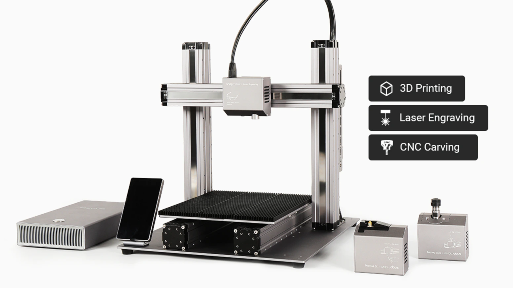</div>

### Quali sono i tipi di stampanti 3D?
* A metallo (SLM) <div class="img" id="img-metallo">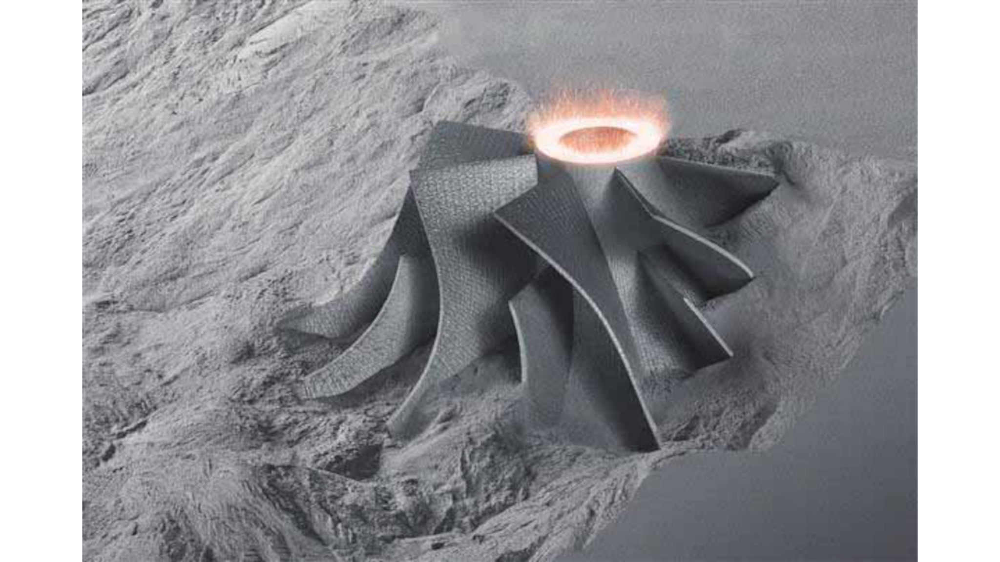</div>
* A resina (SLA, DLP) <div class="img" id="img-resina">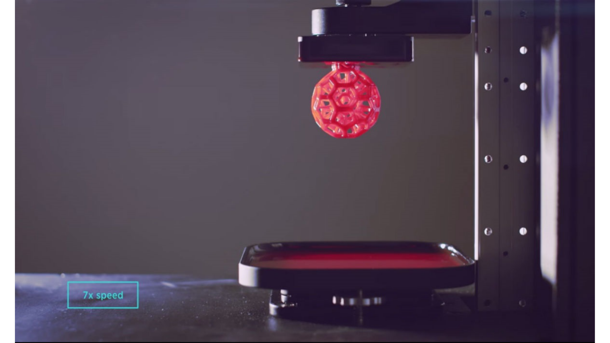</div>
* A filamento (FDM) <div class="img" id="img-filo">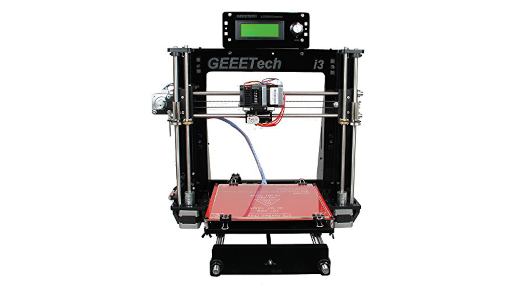</div>

[Che cosa significano gli acronimi?](https://youtu.be/B_SBRsbarRw)

### Stampanti 3D o 2.5D?
[La vera stampa 3D - non planar 3d printing](https://youtu.be/gmePlcU0TRw) <div class="img" id="img-nonplanar">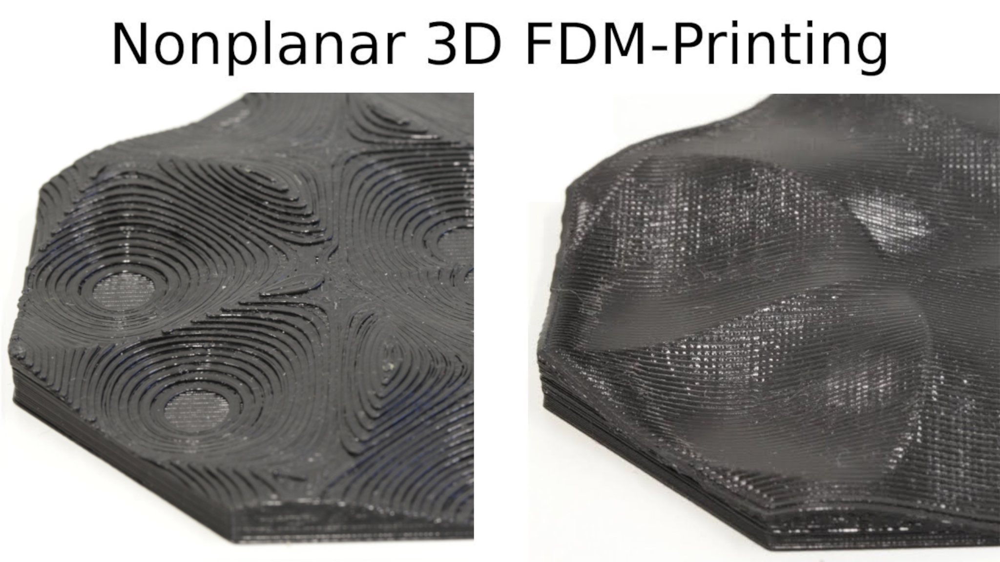</div>

### Tipi di filamento
* PLA (PETG)
* ABS (ASA)

[Tutti i filamenti e le loro proprietà](https://youtu.be/vSwumoSlZTo)

### La mia stampante
GeeeTech i3ProB

Scheda madre: GT 2560 rev A+ (Arduino Mega 2560 + RAMPS 1.4)

Firmware Marlin 1.0.2

<div class="footer"><span class="autore">Gianluca Fabris</span><span class="titolo">Arte generativa in un'altra dimensione - Esame di Fondamenti di scienza dei dati</span></div>
</div>

<!--preparo per le prossime slide-->
```{r}
#carico librerie necessarie
library(tidyr)
library(dplyr)
library(ggplot2)
library(modelr)

#carico csv
stampa1 = read.csv("data/stampa1.csv", header = TRUE, sep = ";")
stampa2 = read.csv("data/stampa2.csv", header = TRUE, sep = ";")

#divido i dataframe in dataframe più piccoli
stampa1_movimenti = stampa1 %>%
  filter(grepl("G[0-1]", codice))
stampa1_temperature = stampa1 %>%
  filter(grepl("M105", codice))
stampa1_resetE = stampa1 %>%
  filter(grepl("G92", codice))
stampa1_home_bl = stampa1 %>%
  filter(grepl("G2[8-9]", codice))
stampa1_accelerazione = stampa1 %>%
  filter(grepl("M204", codice))
stampa1_progresso = stampa1 %>%
  filter(grepl("M73", codice))
stampa1_ventola = stampa1 %>%
  filter(grepl("M10[6-7]", codice))
stampa1_posizione_assoluta_relativa = stampa1 %>%
  filter(grepl("G9[0-1]|M8[2-3]", codice))
stampa1_temperature_imposta_attendi = stampa1 %>%
  filter(grepl("M104|M109|M140|M190", codice))
stampa1_misure_imperiali_metriche = stampa1 %>%
  filter(grepl("G2[0-1]", codice))
stampa1_spegni_motori = stampa1 %>%
  filter(grepl("M84", codice))
stampa1_seleziona_strumento = stampa1 %>%
  filter(!grepl("G[0-1]|M105|G92|G2[8-9]|M204|M73|M10[6-7]|G9[0-1]|M8[2-3]|M104|M109|M140|M190|G2[0-1]|M84", codice))
stampa2_movimenti = stampa2 %>%
  filter(grepl("G[0-1]", codice))
stampa2_temperature = stampa2 %>%
  filter(grepl("M105", codice))
stampa2_resetE = stampa2 %>%
  filter(grepl("G92", codice))
stampa2_home_bl = stampa2 %>%
  filter(grepl("G2[8-9]", codice))
stampa2_accelerazione = stampa2 %>%
  filter(grepl("M204", codice))
stampa2_progresso = stampa2 %>%
  filter(grepl("M73", codice))
stampa2_ventola = stampa2 %>%
  filter(grepl("M10[6-7]", codice))
stampa2_posizione_assoluta_relativa = stampa2 %>%
  filter(grepl("G9[0-1]|M8[2-3]", codice))
stampa2_temperature_imposta_attendi = stampa2 %>%
  filter(grepl("M104|M109|M140|M190", codice))
stampa2_misure_imperiali_metriche = stampa2 %>%
  filter(grepl("G2[0-1]", codice))
stampa2_spegni_motori = stampa2 %>%
  filter(grepl("M84", codice))
stampa2_seleziona_strumento = stampa2 %>%
  filter(!grepl("G[0-1]|M105|G92|G2[8-9]|M204|M73|M10[6-7]|G9[0-1]|M8[2-3]|M104|M109|M140|M190|G2[0-1]|M84", codice))

#divido dati (valori composti)
stampa1_movimenti = stampa1_movimenti %>%
  separate(codice, c("Tipo movimento", "altro"), " X") %>%
  separate(altro, c("X", "altro"), " Y") %>%
  separate(altro, c("Y", "altro"), " E") %>%
  separate(altro, c("E", "F"), " F") %>%
  separate(Y, c("Y", "F"), " F") %>%
  separate("Tipo movimento", c("Tipo movimento", "Z"), " Z") %>%
  separate("Tipo movimento", c("Tipo movimento", "E"), " E") %>%
  separate("Tipo movimento", c("Tipo movimento", "F"), " F") %>%
  separate(Z, c("Z", "F"), " F") %>% separate(E, c("E", "F"), " F")
stampa1_temperature = stampa1_temperature %>%
  separate(risposta, c("stato", "altro"), " T:") %>%
  separate(altro, c("Temperatura estrusori - attuale", "altro"), " B:") %>%
  separate(altro, c("Temperatura piatto - attuale", "altro"), " T0:") %>%
  separate(altro, c("Temperatura estrusore 0 - attuale", "altro"), " @:") %>%
  separate(altro, c("Richiesta energia estrusore", "Richiesta energia piatto"), " B@:") %>%
  separate("Temperatura estrusori - attuale", c("Temperatura estrusori - attuale", "Temperatura estrusori - obiettivo"), " /") %>%
  separate("Temperatura piatto - attuale", c("Temperatura piatto - attuale", "Temperatura piatto - obiettivo"), " /") %>%
  separate("Temperatura estrusore 0 - attuale", c("Temperatura estrusore 0 - attuale", "Temperatura estrusore 0 - obiettivo"), " /") #Temperatura estrusori - attuale / Temperatura estrusori - obiettivo" e Temperatura estrusore 0 - attuale / Temperatura estrusore 0 - obiettivo sono uguali perchè ho un solo estrusore
stampa1_accelerazione = stampa1_accelerazione %>%
  separate(codice, c("codice", "Accelerazione"), "M204 S")
stampa1_accelerazione$codice = NULL
stampa1_ventola = stampa1_ventola %>%
  separate(codice, c("codice", "Ventola"), "M106 S")
stampa1_ventola$Ventola[is.na(stampa1_ventola$Ventola)] = 0
stampa1_ventola$codice = NULL
stampa2_movimenti = stampa2_movimenti %>%
  separate(codice, c("Tipo movimento", "altro"), " X") %>%
  separate(altro, c("X", "altro"), " Y") %>%
  separate(altro, c("Y", "altro"), " E") %>%
  separate(altro, c("E", "F"), " F") %>%
  separate(Y, c("Y", "F"), " F") %>%
  separate("Tipo movimento", c("Tipo movimento", "Z"), " Z") %>%
  separate("Tipo movimento", c("Tipo movimento", "E"), " E") %>%
  separate("Tipo movimento", c("Tipo movimento", "F"), " F") %>%
  separate(Z, c("Z", "F"), " F") %>%
  separate(E, c("E", "F"), " F")
stampa2_temperature = stampa2_temperature %>%
  separate(risposta, c("stato", "altro"), " T:") %>%
  separate(altro, c("Temperatura estrusori - attuale", "altro"), " B:") %>%
  separate(altro, c("Temperatura piatto - attuale", "altro"), " T0:") %>%
  separate(altro, c("Temperatura estrusore 0 - attuale", "altro"), " @:") %>%
  separate(altro, c("Richiesta energia estrusore", "Richiesta energia piatto"), " B@:") %>%
  separate("Temperatura estrusori - attuale", c("Temperatura estrusori - attuale", "Temperatura estrusori - obiettivo"), " /") %>%
  separate("Temperatura piatto - attuale", c("Temperatura piatto - attuale", "Temperatura piatto - obiettivo"), " /") %>%
  separate("Temperatura estrusore 0 - attuale", c("Temperatura estrusore 0 - attuale", "Temperatura estrusore 0 - obiettivo"), " /") #Temperatura estrusori - attuale / Temperatura estrusori - obiettivo" e Temperatura estrusore 0 - attuale / Temperatura estrusore 0 - obiettivo sono uguali perchè ho un solo estrusore
stampa2_accelerazione = stampa2_accelerazione %>%
  separate(codice, c("M204", "Accelerazione"), "M204 S")
stampa2_accelerazione$M204 = NULL
stampa2_ventola = stampa2_ventola %>%
  separate(codice, c("codice", "Ventola"), "M106 S")
stampa2_ventola$Ventola[is.na(stampa2_ventola$Ventola)] = 0
stampa2_ventola$codice = NULL

#dati come numeri
stampa1_movimenti$X = as.numeric(stampa1_movimenti$X)
stampa1_movimenti$Y = as.numeric(stampa1_movimenti$Y)
stampa1_movimenti$Z = as.numeric(stampa1_movimenti$Z)
stampa1_movimenti$E = as.numeric(stampa1_movimenti$E)
stampa1_movimenti$F = as.numeric(stampa1_movimenti$F)
stampa1_temperature$`Temperatura estrusori - attuale` = as.numeric(stampa1_temperature$`Temperatura estrusori - attuale`)
stampa1_temperature$`Temperatura estrusori - obiettivo` = as.numeric(stampa1_temperature$`Temperatura estrusori - obiettivo`)
stampa1_temperature$`Temperatura piatto - attuale` = as.numeric(stampa1_temperature$`Temperatura piatto - attuale`)
stampa1_temperature$`Temperatura piatto - obiettivo` = as.numeric(stampa1_temperature$`Temperatura piatto - obiettivo`)
stampa1_temperature$`Temperatura estrusore 0 - attuale` = as.numeric(stampa1_temperature$`Temperatura estrusore 0 - attuale`)
stampa1_temperature$`Temperatura estrusore 0 - obiettivo` = as.numeric(stampa1_temperature$`Temperatura estrusore 0 - obiettivo`)
stampa1_temperature$`Richiesta energia estrusore` = as.numeric(stampa1_temperature$`Richiesta energia estrusore`)
stampa1_temperature$`Richiesta energia piatto` = as.numeric(stampa1_temperature$`Richiesta energia piatto`)
stampa1_accelerazione$Accelerazione = as.numeric(stampa1_accelerazione$Accelerazione)
stampa1_ventola$Ventola = as.numeric(stampa1_ventola$Ventola)
stampa2_movimenti$X = as.numeric(stampa2_movimenti$X)
stampa2_movimenti$Y = as.numeric(stampa2_movimenti$Y)
stampa2_movimenti$Z = as.numeric(stampa2_movimenti$Z)
stampa2_movimenti$E = as.numeric(stampa2_movimenti$E)
stampa2_movimenti$F = as.numeric(stampa2_movimenti$F)
stampa2_temperature$`Temperatura estrusori - attuale` = as.numeric(stampa2_temperature$`Temperatura estrusori - attuale`)
stampa2_temperature$`Temperatura estrusori - obiettivo` = as.numeric(stampa2_temperature$`Temperatura estrusori - obiettivo`)
stampa2_temperature$`Temperatura piatto - attuale` = as.numeric(stampa2_temperature$`Temperatura piatto - attuale`)
stampa2_temperature$`Temperatura piatto - obiettivo` = as.numeric(stampa2_temperature$`Temperatura piatto - obiettivo`)
stampa2_temperature$`Temperatura estrusore 0 - attuale` = as.numeric(stampa2_temperature$`Temperatura estrusore 0 - attuale`)
stampa2_temperature$`Temperatura estrusore 0 - obiettivo` = as.numeric(stampa2_temperature$`Temperatura estrusore 0 - obiettivo`)
stampa2_temperature$`Richiesta energia estrusore` = as.numeric(stampa2_temperature$`Richiesta energia estrusore`)
stampa2_temperature$`Richiesta energia piatto` = as.numeric(stampa2_temperature$`Richiesta energia piatto`)
stampa2_accelerazione$Accelerazione = as.numeric(stampa2_accelerazione$Accelerazione)
stampa2_ventola$Ventola = as.numeric(stampa2_ventola$Ventola)

#metto in scala giusta richiesta energia (da 0-127 a 0-100)
stampa1_temperature$`Richiesta energia estrusore %` = round(stampa1_temperature$`Richiesta energia estrusore`*(100/127), 1)
stampa1_temperature$`Richiesta energia piatto %` = round(stampa1_temperature$`Richiesta energia piatto`*(100/127), 1)
stampa2_temperature$`Richiesta energia estrusore %` = round(stampa2_temperature$`Richiesta energia estrusore`*(100/127), 1)
stampa2_temperature$`Richiesta energia piatto %` = round(stampa2_temperature$`Richiesta energia piatto`*(100/127), 1)

#metto in scala giusta ventola (da 0-255 a 0-100)
stampa1_ventola$`Ventola %` = round(stampa1_ventola$Ventola*(100/255), 1)
stampa2_ventola$`Ventola %` = round(stampa2_ventola$Ventola*(100/255), 1)

#aggiungo posizione prima riga in quanto la conosco da G29 (bed leveling)
stampa1_movimenti$X[1] = 180.00
stampa1_movimenti$Y[1] = 197.00 #+37 per differenza tra estrusore e bltouch
stampa2_movimenti$X[1] = 180.00
stampa2_movimenti$Y[1] = 197.00 #+37 per differenza tra estrusore e bltouch

#dati NA posso copiare quelli sopra inquanto non variano (posizione XYZ)
stampa1_movimenti = stampa1_movimenti %>%
  fill(X)
stampa1_movimenti = stampa1_movimenti %>%
  fill(Y)
stampa1_movimenti = stampa1_movimenti %>%
  fill(Z)
stampa1_movimenti = stampa1_movimenti %>%
  fill(F)
stampa2_movimenti = stampa2_movimenti %>%
  fill(X)
stampa2_movimenti = stampa2_movimenti %>%
  fill(Y)
stampa2_movimenti = stampa2_movimenti %>%
  fill(Z)
stampa2_movimenti = stampa2_movimenti %>%
  fill(F)
```

<!--slide 2-->
<div class="slide">
<div class="controlli"><a href="#" class="prev">&#11013;</a>slide<a href="#" class="next">&#11157;</a></div>

# Analisi stampa 1 - Michael Noll

### Informazioni
* Input: immagine di Michael Noll <div class="img" id="img-1">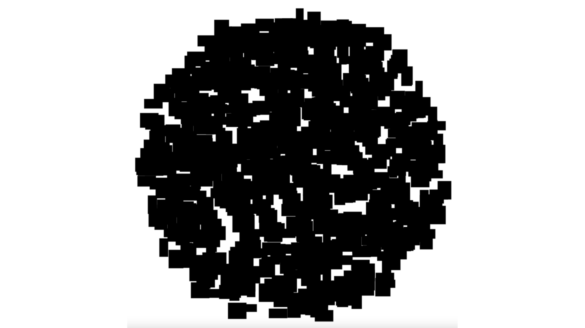</div>
* Progetto: FreeCAD <div class="img" id="img-1-progetto">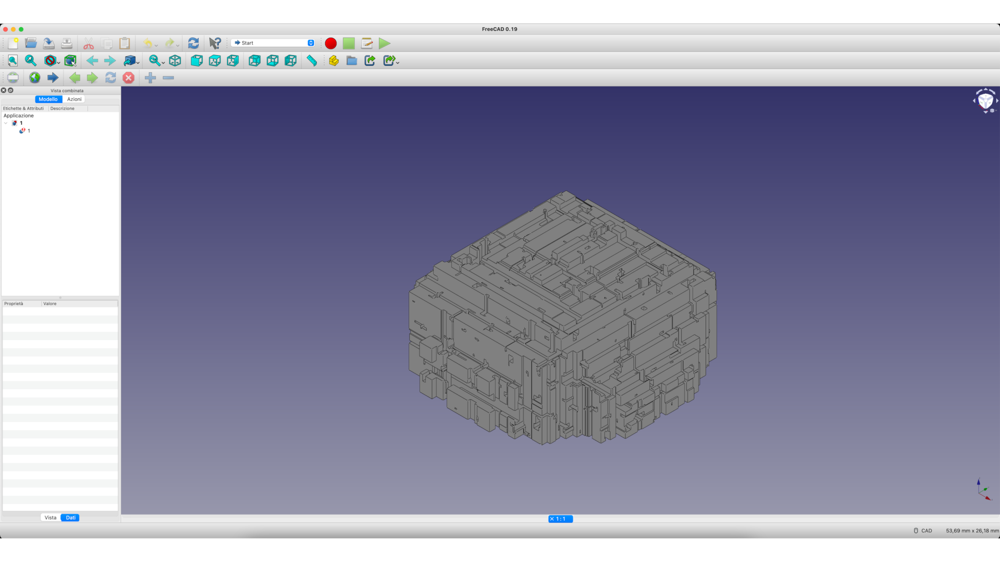</div>
* Stampa <div class="img" id="img-1-fine">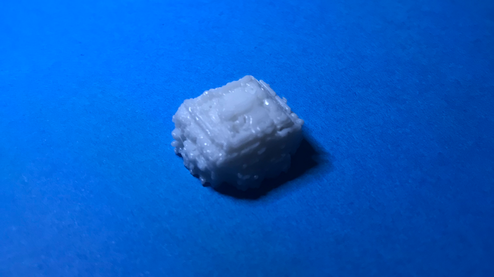</div>

<div class="footer"><span class="autore">Gianluca Fabris</span><span class="titolo">Arte generativa in un'altra dimensione - Esame di Fondamenti di scienza dei dati</span></div>
</div>

<!--slide 3-->
<div class="slide">
<div class="controlli"><a href="#" class="prev">&#11013;</a>slide<a href="#" class="next">&#11157;</a></div>

# I movimenti rispecchiano la stampa?

```{r}
#grafico movimenti XYZ
stampa1_movimenti %>%
  ggplot(aes(x=X, y=Y, color=Z)) +
    geom_point(alpha=0.1) +
    scale_x_continuous(limits=c(0, 190), breaks=seq(0, 190, 20)) +
    scale_y_continuous(limits=c(0, 200), breaks=seq(0, 200, 20)) +
    coord_fixed(ratio=1) +
    scale_color_gradient(low="#6B9EE1", high="#86F5FA", limits=c(0, 8.8), breaks=seq(0, 8.8, 2)) +
    labs(title = "Movimenti X Y Z", x = "Movimenti X", y = "Movimenti Y", colour = "Movimenti Z") +
    theme_minimal() +
    theme(axis.text.x=element_text(color="#000000"), axis.text.y=element_text(color="#000000"), axis.line=element_line(color="#000000"), panel.background=element_rect(fill="#ffffff"), panel.grid.major.x=element_line(colour="#ebebeb"), panel.grid.major.y=element_line(colour="#ebebeb"), plot.title=element_text(size=rel(1.5)))

#grafico movimento X tempo
stampa1_movimenti %>%
  ggplot(aes(x=time, y=X)) +
    geom_point(color="#6B9EE1", alpha=0.1) +
    scale_y_continuous(limits=c(0, 190), breaks=seq(0, 190, 10)) +
    labs(title = "Movimenti X", x = "Tempo", y = "Movimenti X") +
    theme_minimal() +
    theme(axis.text.x=element_blank(), axis.text.y=element_text(color="#000000"), axis.line=element_line(color="#000000"), panel.background=element_rect(fill="#ffffff"), panel.grid.major.x=element_blank(), panel.grid.major.y=element_line(colour="#ebebeb"), plot.title=element_text(size=rel(1.5)))

#grafico movimento Y tempo
stampa1_movimenti %>%
  ggplot(aes(x=time, y=Y)) +
    geom_point(color="#6B9EE1", alpha=0.1) +
    scale_y_continuous(limits=c(0, 200), breaks=seq(0, 200, 10)) +
    labs(title = "Movimenti Y", x = "Tempo", y = "Movimenti Y") +
    theme_minimal() +
    theme(axis.text.x=element_blank(), axis.text.y=element_text(color="#000000"), axis.line=element_line(color="#000000"), panel.background=element_rect(fill="#ffffff"), panel.grid.major.x=element_blank(), panel.grid.major.y=element_line(colour="#ebebeb"), plot.title=element_text(size=rel(1.5)))

#grafico movimento Z tempo
stampa1_movimenti %>%
  ggplot(aes(x=time, y=Z)) +
    geom_point(color="#6B9EE1", alpha=0.1) +
    scale_y_continuous(limits=c(0, 180), breaks=seq(0, 180, 10)) +
    labs(title = "Movimenti Z", x = "Tempo", y = "Movimenti Z") +
    theme_minimal() +
    theme(axis.text.x=element_blank(), axis.text.y=element_text(color="#000000"), axis.line=element_line(color="#000000"), panel.background=element_rect(fill="#ffffff"), panel.grid.major.x=element_blank(), panel.grid.major.y=element_line(colour="#ebebeb"), plot.title=element_text(size=rel(1.5)))

#tolgo na e valori deretrazione (10) perchè non hanno il corrispettico retrazione (-10) e viceversa (prima riga e ultima riga)
stampa1_movimenti_E = stampa1_movimenti[!is.na(stampa1_movimenti$E),]
stampa1_movimenti_E = stampa1_movimenti_E[stampa1_movimenti_E$E!=10,]
stampa1_movimenti_E = stampa1_movimenti_E[stampa1_movimenti_E$E>=0,]

#grafico movimento E tempo (con reset E)
ggplot() +
  geom_point(data=stampa1_movimenti_E, mapping=aes(x=time, y=E), color="#6B9EE1", alpha=0.1) +
  geom_vline(data=stampa1_resetE, mapping=aes(xintercept=time), color="#86F5FA", alpha=0.25) +
  scale_y_continuous(limits=c(0, 155), breaks=seq(0, 155, 10)) +
  labs(title = "Movimenti E (con reset E)", x = "Tempo", y = "Movimenti E (con reset E)") +
  theme_minimal() +
  theme(axis.text.x=element_blank(), axis.text.y=element_text(color="#000000"), axis.line=element_line(color="#000000"), panel.background=element_rect(fill="#ffffff"), panel.grid.major.x=element_blank(), panel.grid.major.y=element_line(colour="#ebebeb"), plot.title=element_text(size=rel(1.5)))

#metto in scala giusta movimento E (togliendo reset E e ultima riga da posizione relativa a posizione assoluta)
stampa1_movimenti_E_resetE = full_join(stampa1_movimenti_E, stampa1_resetE, by="time")
stampa1_movimenti_E_resetE = stampa1_movimenti_E_resetE %>%
  rename(risposta_movimenti = risposta.x, risposta_resetE = risposta.y)
stampa1_movimenti_E_resetE = stampa1_movimenti_E_resetE[order(stampa1_movimenti_E_resetE$time),]
stampa1_movimenti_E = stampa1_movimenti_E_resetE
for(i in 2:nrow(stampa1_movimenti_E_resetE)){
  if(!is.na(stampa1_movimenti_E_resetE$E[i-1]) && !is.na(stampa1_movimenti_E_resetE$codice[i])){
    stampa1_movimenti_E[i:nrow(stampa1_movimenti_E),]$E = stampa1_movimenti_E[i:nrow(stampa1_movimenti_E),]$E + stampa1_movimenti_E_resetE$E[i-1]
  }
}
stampa1_movimenti_E = stampa1_movimenti_E[!is.na(stampa1_movimenti_E$E),] %>%
  select(time, "Tipo movimento", E, F, X, Z, Y, risposta_movimenti) %>%
  rename(risposta = risposta_movimenti)

#grafico movimento E tempo
stampa1_movimenti_E %>%
  ggplot(aes(x=time, y=E)) +
    geom_point(color="#6B9EE1", alpha=0.1) +
    scale_y_continuous(limits=c(0, 550), breaks=seq(0, 550, 50)) +
    labs(title = "Movimenti E", x = "Tempo", y = "Movimenti E") +
    theme_minimal() +
    theme(axis.text.x=element_blank(), axis.text.y=element_text(color="#000000"), axis.line=element_line(color="#000000"), panel.background=element_rect(fill="#ffffff"), panel.grid.major.x=element_blank(), panel.grid.major.y=element_line(colour="#ebebeb"), plot.title=element_text(size=rel(1.5)))
```

# Come sono le velocità e le accelerazioni? C'è correlazione tra velocità e accelerazione?

```{r}
#grafico velocità tempo
stampa1_movimenti %>%
  ggplot(aes(x=time, y=F)) +
    geom_point(color="#6B9EE1", alpha=0.1) +
    scale_y_continuous(limits=c(3500, 5000), breaks=seq(3500, 5000, 500)) +
    labs(title = "Velocità", x = "Tempo", y = "Velocità") +
    theme_minimal() +
    theme(axis.text.x=element_blank(), axis.text.y=element_text(color="#000000"), axis.line=element_line(color="#000000"), panel.background=element_rect(fill="#ffffff"), panel.grid.major.x=element_blank(), panel.grid.major.y=element_line(colour="#ebebeb"), plot.title=element_text(size=rel(1.5)))

#grafico accelerazione tempo
stampa1_accelerazione %>%
  ggplot(aes(x=time, y=Accelerazione)) +
    geom_point(color="#6B9EE1", alpha=0.1) +
    scale_y_continuous(limits=c(500, 1000), breaks=seq(500, 1000, 100)) +
    labs(title = "Accelerazione", x = "Tempo", y = "Accelerazione") +
    theme_minimal() +
    theme(axis.text.x=element_blank(), axis.text.y=element_text(color="#000000"), axis.line=element_line(color="#000000"), panel.background=element_rect(fill="#ffffff"), panel.grid.major.x=element_blank(), panel.grid.major.y=element_line(colour="#ebebeb"), plot.title=element_text(size=rel(1.5)))

#metto insieme velocità e accelerazione
stampa1_movimenti_accelerazione = full_join(stampa1_movimenti, stampa1_accelerazione, by="time")
stampa1_movimenti_accelerazione = stampa1_movimenti_accelerazione %>%
  rename(risposta_movimenti = risposta.x, risposta_accelerazione = risposta.y)
stampa1_movimenti_accelerazione = stampa1_movimenti_accelerazione[order(stampa1_movimenti_accelerazione$time),]
stampa1_movimenti_accelerazione$F[1] = 0
stampa1_movimenti_accelerazione$Accelerazione[1] = 0
stampa1_movimenti_accelerazione = stampa1_movimenti_accelerazione%>%
  fill(F)
stampa1_movimenti_accelerazione = stampa1_movimenti_accelerazione%>%
  fill(Accelerazione)

#correlazione velocità
correlazione1_velocita = lm(Accelerazione~F, data=stampa1_movimenti_accelerazione)

#grafico correlazione velocità
stampa1_movimenti_accelerazione %>%
  ggplot(aes(x=F, y=Accelerazione)) +
    geom_line(group=1, color="#6B9EE1") +
    geom_abline(intercept=correlazione1_velocita$coefficients[1], slope=correlazione1_velocita$coefficients[2], color="#86F5FA") +
    scale_x_continuous(limits=c(3500, 5000), breaks=seq(3500, 5000, 500)) +
    scale_y_continuous(limits=c(500, 1000), breaks=seq(500, 1000, 100)) +
    labs(title = "Correlazione tra velocità e accelerazione", x = "Velocità", y = "Accelerazione") +
    theme_minimal() +
    theme(axis.text.x=element_text(color="#000000"), axis.text.y=element_text(color="#000000"), axis.line=element_line(color="#000000"), panel.background=element_rect(fill="#ffffff"), panel.grid.major.x=element_line(colour="#ebebeb"), panel.grid.major.y=element_line(colour="#ebebeb"), plot.title=element_text(size=rel(1.5)))

#log correlazione velocità
r = cor(stampa1_movimenti_accelerazione$Accelerazione, stampa1_movimenti_accelerazione$F)
r
r^2
```

<div class="footer"><span class="autore">Gianluca Fabris</span><span class="titolo">Arte generativa in un'altra dimensione - Esame di Fondamenti di scienza dei dati</span></div>
</div>

<!--slide 4-->
<div class="slide">
<div class="controlli"><a href="#" class="prev">&#11013;</a>slide<a href="#" class="next">&#11157;</a></div>

# Le temperature sono stabili?

```{r}
#grafico temperatura estusore
ggplot() +
  geom_line(data=stampa1_temperature, mapping=aes(x=time, y=`Temperatura estrusore 0 - attuale`), group=1, color="#6B9EE1") +
  geom_hline(data=stampa1_temperature, mapping=aes(yintercept=`Temperatura estrusore 0 - obiettivo`), color="#86F5FA") +
  scale_y_continuous(limits=c(217, 223), breaks=seq(217, 223, 1)) +
  labs(title = "Temperatura estrusore", x = "Tempo", y = "Temperatura estrusore") +
  theme_minimal() +
  theme(axis.text.x=element_blank(), axis.text.y=element_text(color="#000000"), axis.line=element_line(color="#000000"), panel.background=element_rect(fill="#ffffff"), panel.grid.major.x=element_blank(), panel.grid.major.y=element_line(colour="#ebebeb"), plot.title=element_text(size=rel(1.5)))

#grafico temperatura estusore
stampa1_temperature %>%
  ggplot(aes(x=time, y=`Temperatura estrusore 0 - attuale`)) +
    geom_smooth(aes(group=""), formula=y~x, color="#6B9EE1", fill="#86F5FA") +
    scale_y_continuous() +
    labs(title = "Temperatura estrusore", x = "Tempo", y = "Temperatura estrusore") +
    theme_minimal() +
    theme(axis.text.x=element_blank(), axis.text.y=element_text(color="#000000"), axis.line=element_line(color="#000000"), panel.background=element_rect(fill="#ffffff"), panel.grid.major.x=element_blank(), panel.grid.major.y=element_line(colour="#ebebeb"), plot.title=element_text(size=rel(1.5)))

#grafico richiesta energetica estusore
stampa1_temperature %>%
  ggplot(aes(x=time, y=`Richiesta energia estrusore %`)) +
    geom_line(group=1, color="#6B9EE1") +
    scale_y_continuous(limits=c(0, 100), breaks=seq(0, 100, 10)) +
  labs(title = "Richiesta energetica estrusore", x = "Tempo", y = "Richiesta energetica estrusore") +
  theme_minimal() +
  theme(axis.text.x=element_blank(), axis.text.y=element_text(color="#000000"), axis.line=element_line(color="#000000"), panel.background=element_rect(fill="#ffffff"), panel.grid.major.x=element_blank(), panel.grid.major.y=element_line(colour="#ebebeb"), plot.title=element_text(size=rel(1.5)))

#grafico richiesta energetica estusore
stampa1_temperature %>%
  ggplot(aes(x=time, y=`Richiesta energia estrusore %`)) +
    geom_smooth(aes(group=""), formula=y~x, color="#6B9EE1", fill="#86F5FA") +
    scale_y_continuous() +
    labs(title = "Richiesta energetica estrusore", x = "Tempo", y = "Richiesta energetica estrusore") +
    theme_minimal() +
    theme(axis.text.x=element_blank(), axis.text.y=element_text(color="#000000"), axis.line=element_line(color="#000000"), panel.background=element_rect(fill="#ffffff"), panel.grid.major.x=element_blank(), panel.grid.major.y=element_line(colour="#ebebeb"), plot.title=element_text(size=rel(1.5)))

#grafico temperatura piatto
ggplot() +
  geom_line(data=stampa1_temperature, mapping=aes(x=time, y=`Temperatura piatto - attuale`), group=1, color="#6B9EE1") +
  geom_hline(data=stampa1_temperature, mapping=aes(yintercept=`Temperatura piatto - obiettivo`), color="#86F5FA") +
  scale_y_continuous() +
  labs(title = "Temperatura piatto", x = "Tempo", y = "Temperatura piatto") +
  theme_minimal() +
  theme(axis.text.x=element_blank(), axis.text.y=element_text(color="#000000"), axis.line=element_line(color="#000000"), panel.background=element_rect(fill="#ffffff"), panel.grid.major.x=element_blank(), panel.grid.major.y=element_line(colour="#ebebeb"), plot.title=element_text(size=rel(1.5)))

#grafico temperatura piatto
stampa1_temperature %>%
  ggplot(aes(x=time, y=`Temperatura piatto - attuale`)) +
    geom_smooth(aes(group=""), formula=y~x, color="#6B9EE1", fill="#86F5FA") +
    scale_y_continuous() +
    labs(title = "Temperatura piatto", x = "Tempo", y = "Temperatura piatto") +
    theme_minimal() +
    theme(axis.text.x=element_blank(), axis.text.y=element_text(color="#000000"), axis.line=element_line(color="#000000"), panel.background=element_rect(fill="#ffffff"), panel.grid.major.x=element_blank(), panel.grid.major.y=element_line(colour="#ebebeb"), plot.title=element_text(size=rel(1.5)))

#grafico richiesta energetica piatto
stampa1_temperature %>%
  ggplot(aes(x=time, y=`Richiesta energia piatto %`)) +
    geom_line(group=1, color="#6B9EE1") +
    scale_y_continuous(limits=c(0, 100), breaks=seq(0, 100, 10)) +
  labs(title = "Richiesta energetica piatto", x = "Tempo", y = "Richiesta energetica piatto") +
  theme_minimal() +
  theme(axis.text.x=element_blank(), axis.text.y=element_text(color="#000000"), axis.line=element_line(color="#000000"), panel.background=element_rect(fill="#ffffff"), panel.grid.major.x=element_blank(), panel.grid.major.y=element_line(colour="#ebebeb"), plot.title=element_text(size=rel(1.5)))

#grafico richiesta energetica piatto
stampa1_temperature %>%
  ggplot(aes(x=time, y=`Richiesta energia piatto %`)) +
    geom_smooth(aes(group=""), formula=y~x, color="#6B9EE1", fill="#86F5FA") +
    scale_y_continuous() +
    labs(title = "Richiesta energetica piatto", x = "Tempo", y = "Richiesta energetica piatto") +
    theme_minimal() +
    theme(axis.text.x=element_blank(), axis.text.y=element_text(color="#000000"), axis.line=element_line(color="#000000"), panel.background=element_rect(fill="#ffffff"), panel.grid.major.x=element_blank(), panel.grid.major.y=element_line(colour="#ebebeb"), plot.title=element_text(size=rel(1.5)))

```

# C'è correlazione tra la temperatura e la richiesta energetica?

```{r}
#correlazione estrusore
correlazione1_estrusore = lm(`Temperatura estrusore 0 - attuale`~`Richiesta energia estrusore %`, data=stampa1_temperature)

#grafico correlazione estrusore
stampa1_temperature %>%
  ggplot(aes(x=`Richiesta energia estrusore %`, y=`Temperatura estrusore 0 - attuale`)) +
    geom_line(group=1, color="#6B9EE1") +
    geom_abline(intercept=correlazione1_estrusore$coefficients[1], slope=correlazione1_estrusore$coefficients[2], color="#86F5FA") +
    scale_x_continuous(limits=c(0, 100), breaks=seq(0, 100, 10)) +
    scale_y_continuous(limits=c(217, 223), breaks=seq(217, 223, 1)) +
    labs(title = "Correlazione tra richiesta energetica e temperatura estrusore", x = "Richiesta energetica estrusore", y = "Temperatura estrusore") +
    theme_minimal() +
    theme(axis.text.x=element_text(color="#000000"), axis.text.y=element_text(color="#000000"), axis.line=element_line(color="#000000"), panel.background=element_rect(fill="#ffffff"), panel.grid.major.x=element_line(colour="#ebebeb"), panel.grid.major.y=element_line(colour="#ebebeb"), plot.title=element_text(size=rel(1.5)))

#log correlazione estrusore
r = cor(stampa1_temperature$`Temperatura estrusore 0 - attuale`, stampa1_temperature$`Richiesta energia estrusore %`)
r
r^2

#correlazione piatto
correlazione1_piatto = lm(`Temperatura piatto - attuale`~`Richiesta energia piatto %`, data=stampa1_temperature)

#grafico correlazione piatto
stampa1_temperature %>%
  ggplot(aes(x=`Richiesta energia piatto %`, y=`Temperatura piatto - attuale`)) +
    geom_line(group=1, color="#6B9EE1") +
    geom_abline(intercept=correlazione1_piatto$coefficients[1], slope=correlazione1_piatto$coefficients[2], color="#86F5FA") +
    scale_x_continuous(limits=c(0, 100), breaks=seq(0, 100, 10)) +
    scale_y_continuous() +
    labs(title = "Correlazione tra richiesta energetica e temperatura piatto", x = "Richiesta energetica piatto", y = "Temperatura piatto") +
    theme_minimal() +
    theme(axis.text.x=element_text(color="#000000"), axis.text.y=element_text(color="#000000"), axis.line=element_line(color="#000000"), panel.background=element_rect(fill="#ffffff"), panel.grid.major.x=element_line(colour="#ebebeb"), panel.grid.major.y=element_line(colour="#ebebeb"), plot.title=element_text(size=rel(1.5)))

#log correlazione piatto
r = cor(stampa1_temperature$`Temperatura piatto - attuale`, stampa1_temperature$`Richiesta energia piatto %`)
r
r^2
```

<div class="footer"><span class="autore">Gianluca Fabris</span><span class="titolo">Arte generativa in un'altra dimensione - Esame di Fondamenti di scienza dei dati</span></div>
</div>

<!--slide 5-->
<div class="slide">
<div class="controlli"><a href="#" class="prev">&#11013;</a>slide<a href="#" class="next">&#11157;</a></div>

# Com'è la ventola?

```{r}
#grafico ventola tempo
stampa1_ventola %>%
  ggplot(aes(x=time, y=`Ventola %`)) +
    geom_point(color="#6B9EE1", alpha=0.5) +
    scale_y_continuous() +
    labs(title = "Richiesta energetica piatto", x = "Tempo", y = "Richiesta energetica piatto") +
    theme_minimal() +
    theme(axis.text.x=element_blank(), axis.text.y=element_text(color="#000000"), axis.line=element_line(color="#000000"), panel.background=element_rect(fill="#ffffff"), panel.grid.major.x=element_blank(), panel.grid.major.y=element_line(colour="#ebebeb"), plot.title=element_text(size=rel(1.5)))
```

# C'è correlazione tra la ventola e la temperatura?

```{r}
#metto insieme ventola e temperatura
stampa1_temperature_ventola = full_join(stampa1_temperature, stampa1_ventola, by="time")
stampa1_temperature_ventola = stampa1_temperature_ventola[order(stampa1_temperature_ventola$time),]
stampa1_temperature_ventola$`Temperatura estrusore 0 - attuale`[1] = 222.7
stampa1_temperature_ventola = stampa1_temperature_ventola%>%
  fill(`Ventola %`)
stampa1_temperature_ventola = stampa1_temperature_ventola%>%
  fill(`Temperatura estrusore 0 - attuale`)

#correlazione ventola
correlazione1_ventola = lm(`Temperatura estrusore 0 - attuale`~`Ventola %`, data=stampa1_temperature_ventola)

#grafico correlazione ventola
stampa1_temperature_ventola %>%
  ggplot(aes(x=`Ventola %`, y=`Temperatura estrusore 0 - attuale`)) +
    geom_line(group=1, color="#6B9EE1") +
    geom_abline(intercept=correlazione1_ventola$coefficients[1], slope=correlazione1_ventola$coefficients[2], color="#86F5FA") +
    scale_x_continuous(limits=c(0, 100), breaks=seq(0, 100, 10)) +
    scale_y_continuous() +
    labs(title = "Correlazione tra ventila e temperatura estrusore", x = "Ventola", y = "Temperatura estrusore") +
    theme_minimal() +
    theme(axis.text.x=element_text(color="#000000"), axis.text.y=element_text(color="#000000"), axis.line=element_line(color="#000000"), panel.background=element_rect(fill="#ffffff"), panel.grid.major.x=element_line(colour="#ebebeb"), panel.grid.major.y=element_line(colour="#ebebeb"), plot.title=element_text(size=rel(1.5)))

#log correlazione ventola
r = cor(stampa1_temperature_ventola$`Temperatura estrusore 0 - attuale`, stampa1_temperature_ventola$`Ventola %`)
r
r^2
```

<div class="footer"><span class="autore">Gianluca Fabris</span><span class="titolo">Arte generativa in un'altra dimensione - Esame di Fondamenti di scienza dei dati</span></div>
</div>

<!--slide 6-->
<div class="slide">
<div class="controlli"><a href="#" class="prev">&#11013;</a>slide<a href="#" class="next">&#11157;</a></div>

# Il tempo stimato è coerente a quello effettivo?

Tempo stimato dallo slicer: 46 minuti

```{r}
#tempo inizio e fine
tempo = data.frame(c(stampa1[1,]$time, stampa1[nrow(stampa1),]$time))
names(tempo) = c("time")
tempo = tempo %>%
  separate(time, c("ore", "minuti", "secondi"), ":")

#dati come numeri
tempo$ore = as.numeric(tempo$ore)
tempo$minuti = as.numeric(tempo$minuti)
tempo$secondi = as.numeric(tempo$secondi)

#differenza tempo fine e inizio
diff_ore = tempo[2,]$ore - tempo[1,]$ore
diff_minuti = tempo[2,]$minuti - tempo[1,]$minuti
diff_secondi = tempo[2,]$secondi - tempo[1,]$secondi
if(diff_minuti<0){
  diff_ore = diff_ore - 1
  diff_minuti = diff_minuti + 60
}
if(diff_secondi<0){
  diff_minuti = diff_minuti - 1
  diff_secondi = diff_secondi + 60
}
diff_time = as.character(paste(diff_ore, diff_minuti, diff_secondi, sep=":"))
diff_time
```

# Quali sono i costi e il materiale usato? Il materiale usato è coerente a quello effettivo?

Materiale stimato dallo slicer: 650mm

```{r}
#materiale usato già calcolato in precedenza
stampa1_movimenti_E[nrow(stampa1_movimenti_E),]$E

#stima per eccesso (supponendo alimentatore sempre 100%) dei costi
#si potrebe fare una stima più precisa sapendo: consumo massimo estrusore e piatto e calcolare con richiesta energia estrusore e piatto % * tempo + qualcosa per scheda e accessori (es. porta seriale, lcd, motori, sensori)
#nonostante la stima per eccesso la maggior parte del costo è costituita dal filamento
#energia: KW * h * €/(KW*h) + filamento: m * €/m
round((180/1000*(diff_ore + diff_minuti/60 + 15/60 + diff_secondi/3600)*0.16)+((stampa1_movimenti_E[nrow(stampa1_movimenti_E),]$E+100)/1000*(25/330)), 2)
```

# Com'è il piatto di stampa?

```{r}
#divido dati (valori composti)
stampa1_bl = data.frame(stampa1_home_bl[nrow(stampa1_home_bl),]$risposta)
names(stampa1_bl) = c("bl")
stampa1_bl = stampa1_bl %>%
  separate(bl, c("altro", "1", "2", "3", "4", "5", "6", "7", "8", "9"), "Bed ") %>%
  separate(`9`, c("9", "altro"), "Eqn")
stampa1_bl$altro = as.character(paste("Eqn", stampa1_bl$altro, sep=""))
stampa1_bl$altro = NULL

#raggrupo dati (più osservazioni nella stessa riga)
stampa1_bl = stampa1_bl %>%
  pivot_longer(c("1", "2", "3", "4", "5", "6", "7", "8", "9"), names_to="informazioni", values_to="altro")

#divido dati (valori composti)
stampa1_bl = stampa1_bl %>%
  separate(altro, c("altro", "X"), "x:") %>%
  separate(X, c("X", "Y"), "y:") %>%
  separate(Y, c("Y", "Z"), "z:")
stampa1_bl$altro = NULL

#dati come numeri
stampa1_bl$X = as.numeric(stampa1_bl$X)
stampa1_bl$Y = as.numeric(stampa1_bl$Y)
stampa1_bl$Z = as.numeric(stampa1_bl$Z)

#offset dati per visualizzarli correttamente
stampa1_bl = stampa1_bl[order(stampa1_bl$X),]
stampa1_bl[1:3,]$X = stampa1_bl[1:3,]$X+180/6
stampa1_bl[7:9,]$X = stampa1_bl[7:9,]$X-180/6
stampa1_bl = stampa1_bl[order(stampa1_bl$Y),]
stampa1_bl[1:3,]$Y = stampa1_bl[1:3,]$Y+160/6
stampa1_bl[7:9,]$Y = stampa1_bl[7:9,]$Y-160/6
stampa1_bl = stampa1_bl[order(stampa1_bl$informazioni),]

#grafico piatto
stampa1_bl %>%
  ggplot(aes(x=X, y=Y, fill=Z)) +
    geom_tile() +
    scale_x_continuous(limits=c(0, 190), breaks=seq(0, 190, 20)) +
    scale_y_continuous(limits=c(0, 200), breaks=seq(0, 200, 20)) +
    coord_fixed(ratio=1) +
    scale_fill_gradient(low="#6B9EE1", high="#86F5FA", limits=c(-0.05, 0.55), breaks=seq(-0.05, 0.55, 0.1)) +
    labs(title = "Piatto", x = "X", y = "Y", colour = "Z") +
    theme_minimal() +
    theme(axis.text.x=element_text(color="#000000", angle=90), axis.text.y=element_text(color="#000000"), axis.line=element_line(color="#000000"), panel.background=element_rect(fill="#ffffff"), panel.grid.major.x=element_line(colour="#ebebeb"), panel.grid.major.y=element_line(colour="#ebebeb"), plot.title=element_text(size=rel(1.5)))
```

<div class="footer"><span class="autore">Gianluca Fabris</span><span class="titolo">Arte generativa in un'altra dimensione - Esame di Fondamenti di scienza dei dati</span></div>
</div>

<!--slide 7-->
<div class="slide">
<div class="controlli"><a href="#" class="prev">&#11013;</a>slide<a href="#" class="next">&#11157;</a></div>

# Analisi stampa 2 - topology optimization

### Informazioni
* Progetto: Fusion 360 (Autodesk) <div class="img" id="img-2-progetto">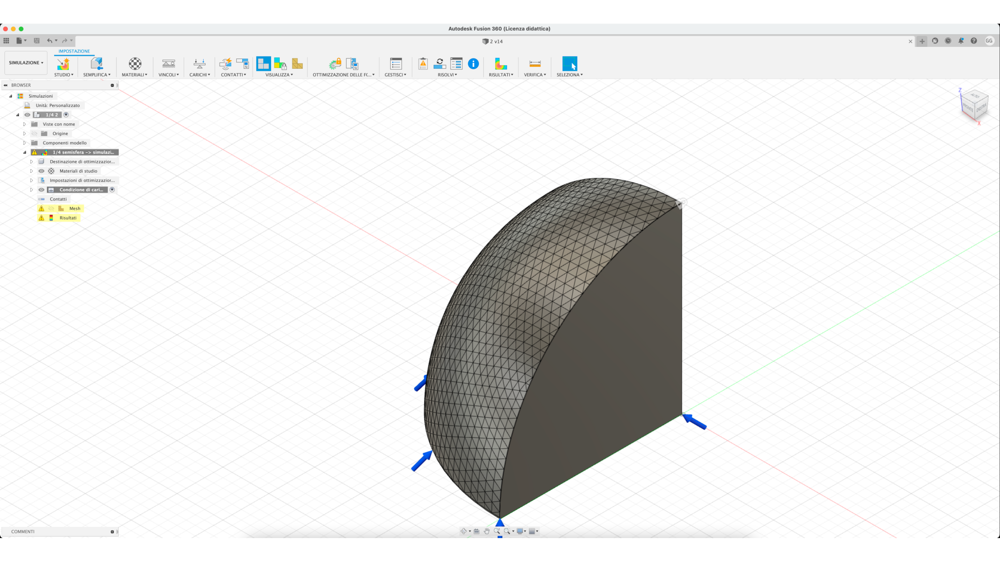</div><div class="img" id="img-2-progetto-2">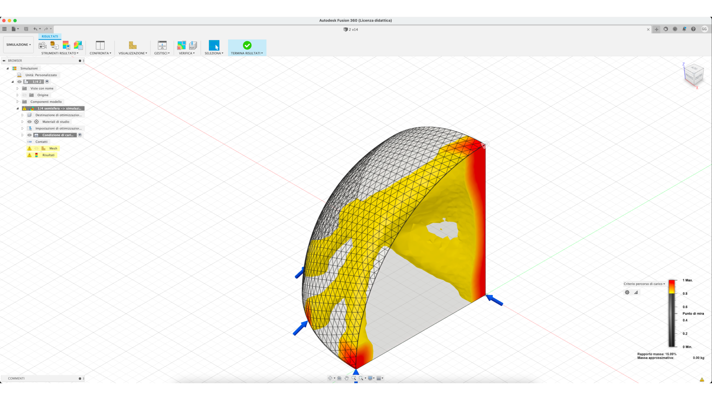</div><div class="img" id="img-2-progetto-3">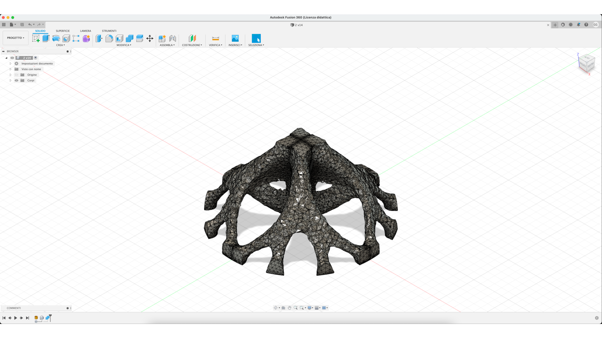</div>
* Stampa <div class="img" id="img-2-fine">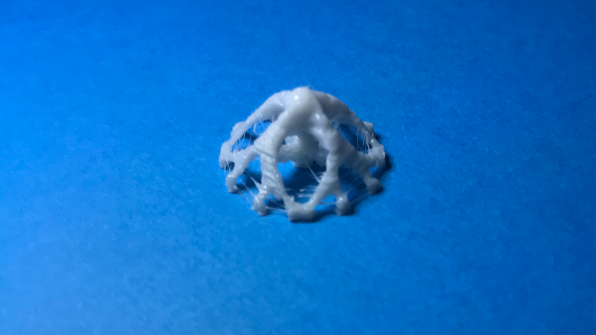</div>

[Che cos'è topology optimization/generative design?](https://youtu.be/3smr5CEdksc)

<div class="footer"><span class="autore">Gianluca Fabris</span><span class="titolo">Arte generativa in un'altra dimensione - Esame di Fondamenti di scienza dei dati</span></div>
</div>

<!--slide 8-->
<div class="slide">
<div class="controlli"><a href="#" class="prev">&#11013;</a>slide<a href="#" class="next">&#11157;</a></div>

# I movimenti rispecchiano la stampa?

```{r}
#grafico movimenti XYZ
stampa2_movimenti %>%
  ggplot(aes(x=X, y=Y, color=Z)) +
    geom_point(alpha=0.1) +
    scale_x_continuous(limits=c(0, 190), breaks=seq(0, 190, 20)) +
    scale_y_continuous(limits=c(0, 200), breaks=seq(0, 200, 20)) +
    coord_fixed(ratio=1) +
    scale_color_gradient(low="#6B9EE1", high="#86F5FA", limits=c(0, 10.2), breaks=seq(0, 10.2, 2)) +
    labs(title = "Movimenti X Y Z", x = "Movimenti X", y = "Movimenti Y", colour = "Movimenti Z") +
    theme_minimal() +
    theme(axis.text.x=element_text(color="#000000"), axis.text.y=element_text(color="#000000"), axis.line=element_line(color="#000000"), panel.background=element_rect(fill="#ffffff"), panel.grid.major.x=element_line(colour="#ebebeb"), panel.grid.major.y=element_line(colour="#ebebeb"), plot.title=element_text(size=rel(1.5)))

#grafico movimento X tempo
stampa2_movimenti %>%
  ggplot(aes(x=time, y=X)) +
    geom_point(color="#6B9EE1", alpha=0.1) +
    scale_y_continuous(limits=c(0, 190), breaks=seq(0, 190, 10)) +
    labs(title = "Movimenti X", x = "Tempo", y = "Movimenti X") +
    theme_minimal() +
    theme(axis.text.x=element_blank(), axis.text.y=element_text(color="#000000"), axis.line=element_line(color="#000000"), panel.background=element_rect(fill="#ffffff"), panel.grid.major.x=element_blank(), panel.grid.major.y=element_line(colour="#ebebeb"), plot.title=element_text(size=rel(1.5)))

#grafico movimento Y tempo
stampa2_movimenti %>%
  ggplot(aes(x=time, y=Y)) +
    geom_point(color="#6B9EE1", alpha=0.1) +
    scale_y_continuous(limits=c(0, 200), breaks=seq(0, 200, 10)) +
    labs(title = "Movimenti Y", x = "Tempo", y = "Movimenti Y") +
    theme_minimal() +
    theme(axis.text.x=element_blank(), axis.text.y=element_text(color="#000000"), axis.line=element_line(color="#000000"), panel.background=element_rect(fill="#ffffff"), panel.grid.major.x=element_blank(), panel.grid.major.y=element_line(colour="#ebebeb"), plot.title=element_text(size=rel(1.5)))

#grafico movimento Z tempo
stampa2_movimenti %>%
  ggplot(aes(x=time, y=Z)) +
    geom_point(color="#6B9EE1", alpha=0.1) +
    scale_y_continuous(limits=c(0, 180), breaks=seq(0, 180, 10)) +
    labs(title = "Movimenti Z", x = "Tempo", y = "Movimenti Z") +
    theme_minimal() +
    theme(axis.text.x=element_blank(), axis.text.y=element_text(color="#000000"), axis.line=element_line(color="#000000"), panel.background=element_rect(fill="#ffffff"), panel.grid.major.x=element_blank(), panel.grid.major.y=element_line(colour="#ebebeb"), plot.title=element_text(size=rel(1.5)))

#tolgo na e valori deretrazione (10) perchè non hanno il corrispettico retrazione (-10) e viceversa (prima riga e ultima riga)
stampa2_movimenti_E = stampa2_movimenti[!is.na(stampa2_movimenti$E),]
stampa2_movimenti_E = stampa2_movimenti_E[stampa2_movimenti_E$E!=10,]
stampa2_movimenti_E = stampa2_movimenti_E[stampa2_movimenti_E$E>=0,]

#grafico movimento E tempo (con reset E)
ggplot() +
  geom_point(data=stampa2_movimenti_E, mapping=aes(x=time, y=E), color="#6B9EE1", alpha=0.1) +
  geom_vline(data=stampa2_resetE, mapping=aes(xintercept=time), color="#86F5FA", alpha=0.25) +
  scale_y_continuous(limits=c(0, 90), breaks=seq(0, 90, 10)) +
  labs(title = "Movimenti E (con reset E)", x = "Tempo", y = "Movimenti E (con reset E)") +
  theme_minimal() +
  theme(axis.text.x=element_blank(), axis.text.y=element_text(color="#000000"), axis.line=element_line(color="#000000"), panel.background=element_rect(fill="#ffffff"), panel.grid.major.x=element_blank(), panel.grid.major.y=element_line(colour="#ebebeb"), plot.title=element_text(size=rel(1.5)))

#metto in scala giusta movimento E (togliendo reset E e ultima riga da posizione relativa a posizione assoluta)
stampa2_movimenti_E_resetE = full_join(stampa2_movimenti_E, stampa2_resetE, by="time")
stampa2_movimenti_E_resetE = stampa2_movimenti_E_resetE %>%
  rename(risposta_movimenti = risposta.x, risposta_resetE = risposta.y)
stampa2_movimenti_E_resetE = stampa2_movimenti_E_resetE[order(stampa2_movimenti_E_resetE$time),]
stampa2_movimenti_E = stampa2_movimenti_E_resetE
for(i in 2:nrow(stampa2_movimenti_E_resetE)){
  if(!is.na(stampa2_movimenti_E_resetE$E[i-1]) && !is.na(stampa2_movimenti_E_resetE$codice[i])){
    stampa2_movimenti_E[i:nrow(stampa2_movimenti_E),]$E = stampa2_movimenti_E[i:nrow(stampa2_movimenti_E),]$E + stampa2_movimenti_E_resetE$E[i-1]
  }
}
stampa2_movimenti_E = stampa2_movimenti_E[!is.na(stampa2_movimenti_E$E),] %>%
  select(time, "Tipo movimento", E, F, X, Z, Y, risposta_movimenti) %>%
  rename(risposta = risposta_movimenti)

#grafico movimento E tempo
stampa2_movimenti_E %>%
  ggplot(aes(x=time, y=E)) +
    geom_point(color="#6B9EE1", alpha=0.1) +
    scale_y_continuous(limits=c(0, 220), breaks=seq(0, 220, 20)) +
    labs(title = "Movimenti E", x = "Tempo", y = "Movimenti E") +
    theme_minimal() +
    theme(axis.text.x=element_blank(), axis.text.y=element_text(color="#000000"), axis.line=element_line(color="#000000"), panel.background=element_rect(fill="#ffffff"), panel.grid.major.x=element_blank(), panel.grid.major.y=element_line(colour="#ebebeb"), plot.title=element_text(size=rel(1.5)))
```

# Come sono le velocità e le accelerazioni? C'è correlazione tra velocità e accelerazione?

```{r}
#grafico velocità tempo
stampa2_movimenti %>%
  ggplot(aes(x=time, y=F)) +
    geom_point(color="#6B9EE1", alpha=0.1) +
    scale_y_continuous(limits=c(3500, 5000), breaks=seq(3500, 5000, 500)) +
    labs(title = "Velocità", x = "Tempo", y = "Velocità") +
    theme_minimal() +
    theme(axis.text.x=element_blank(), axis.text.y=element_text(color="#000000"), axis.line=element_line(color="#000000"), panel.background=element_rect(fill="#ffffff"), panel.grid.major.x=element_blank(), panel.grid.major.y=element_line(colour="#ebebeb"), plot.title=element_text(size=rel(1.5)))

#grafico accelerazione tempo
stampa2_accelerazione %>%
  ggplot(aes(x=time, y=Accelerazione)) +
    geom_point(color="#6B9EE1", alpha=0.1) +
    scale_y_continuous(limits=c(500, 1000), breaks=seq(500, 1000, 100)) +
    labs(title = "Accelerazione", x = "Tempo", y = "Accelerazione") +
    theme_minimal() +
    theme(axis.text.x=element_blank(), axis.text.y=element_text(color="#000000"), axis.line=element_line(color="#000000"), panel.background=element_rect(fill="#ffffff"), panel.grid.major.x=element_blank(), panel.grid.major.y=element_line(colour="#ebebeb"), plot.title=element_text(size=rel(1.5)))

#metto insieme velocità e accelerazione
stampa2_movimenti_accelerazione = full_join(stampa2_movimenti, stampa2_accelerazione, by="time")
stampa2_movimenti_accelerazione = stampa2_movimenti_accelerazione %>%
  rename(risposta_movimenti = risposta.x, risposta_accelerazione = risposta.y)
stampa2_movimenti_accelerazione = stampa2_movimenti_accelerazione[order(stampa2_movimenti_accelerazione$time),]
stampa2_movimenti_accelerazione$F[1] = 0
stampa2_movimenti_accelerazione$Accelerazione[1] = 0
stampa2_movimenti_accelerazione = stampa2_movimenti_accelerazione%>%
  fill(F)
stampa2_movimenti_accelerazione = stampa2_movimenti_accelerazione%>%
  fill(Accelerazione)

#correlazione velocità
correlazione2_velocita = lm(Accelerazione~F, data=stampa2_movimenti_accelerazione)

#grafico correlazione velocità
stampa2_movimenti_accelerazione %>%
  ggplot(aes(x=F, y=Accelerazione)) +
    geom_line(group=1, color="#6B9EE1") +
    geom_abline(intercept=correlazione1_velocita$coefficients[1], slope=correlazione1_velocita$coefficients[2], color="#86F5FA") +
    scale_x_continuous(limits=c(3500, 5000), breaks=seq(3500, 5000, 500)) +
    scale_y_continuous(limits=c(500, 1000), breaks=seq(500, 1000, 100)) +
    labs(title = "Correlazione tra velocità e accelerazione", x = "Velocità", y = "Accelerazione") +
    theme_minimal() +
    theme(axis.text.x=element_text(color="#000000"), axis.text.y=element_text(color="#000000"), axis.line=element_line(color="#000000"), panel.background=element_rect(fill="#ffffff"), panel.grid.major.x=element_line(colour="#ebebeb"), panel.grid.major.y=element_line(colour="#ebebeb"), plot.title=element_text(size=rel(1.5)))

#log correlazione velocità
r = cor(stampa2_movimenti_accelerazione$Accelerazione, stampa2_movimenti_accelerazione$F)
r
r^2
```

<div class="footer"><span class="autore">Gianluca Fabris</span><span class="titolo">Arte generativa in un'altra dimensione - Esame di Fondamenti di scienza dei dati</span></div>
</div>

<!--slide 9-->
<div class="slide">
<div class="controlli"><a href="#" class="prev">&#11013;</a>slide<a href="#" class="next">&#11157;</a></div>

# Le temperature sono stabili?

```{r}
#grafico temperatura estusore
ggplot() +
  geom_line(data=stampa2_temperature, mapping=aes(x=time, y=`Temperatura estrusore 0 - attuale`), group=1, color="#6B9EE1") +
  geom_hline(data=stampa2_temperature, mapping=aes(yintercept=`Temperatura estrusore 0 - obiettivo`), color="#86F5FA") +
  scale_y_continuous(limits=c(216, 224), breaks=seq(216, 224, 1)) +
  labs(title = "Temperatura estrusore", x = "Tempo", y = "Temperatura estrusore") +
  theme_minimal() +
  theme(axis.text.x=element_blank(), axis.text.y=element_text(color="#000000"), axis.line=element_line(color="#000000"), panel.background=element_rect(fill="#ffffff"), panel.grid.major.x=element_blank(), panel.grid.major.y=element_line(colour="#ebebeb"), plot.title=element_text(size=rel(1.5)))

#grafico temperatura estusore
stampa2_temperature %>%
  ggplot(aes(x=time, y=`Temperatura estrusore 0 - attuale`)) +
    geom_smooth(aes(group=""), formula=y~x, color="#6B9EE1", fill="#86F5FA") +
    scale_y_continuous() +
    labs(title = "Temperatura estrusore", x = "Tempo", y = "Temperatura estrusore") +
    theme_minimal() +
    theme(axis.text.x=element_blank(), axis.text.y=element_text(color="#000000"), axis.line=element_line(color="#000000"), panel.background=element_rect(fill="#ffffff"), panel.grid.major.x=element_blank(), panel.grid.major.y=element_line(colour="#ebebeb"), plot.title=element_text(size=rel(1.5)))

#grafico richiesta energetica estusore
stampa2_temperature %>%
  ggplot(aes(x=time, y=`Richiesta energia estrusore %`)) +
    geom_line(group=1, color="#6B9EE1") +
    scale_y_continuous(limits=c(0, 100), breaks=seq(0, 100, 10)) +
  labs(title = "Richiesta energetica estrusore", x = "Tempo", y = "Richiesta energetica estrusore") +
  theme_minimal() +
  theme(axis.text.x=element_blank(), axis.text.y=element_text(color="#000000"), axis.line=element_line(color="#000000"), panel.background=element_rect(fill="#ffffff"), panel.grid.major.x=element_blank(), panel.grid.major.y=element_line(colour="#ebebeb"), plot.title=element_text(size=rel(1.5)))

#grafico richiesta energetica estusore
stampa2_temperature %>%
  ggplot(aes(x=time, y=`Richiesta energia estrusore %`)) +
    geom_smooth(aes(group=""), formula=y~x, color="#6B9EE1", fill="#86F5FA") +
    scale_y_continuous() +
    labs(title = "Richiesta energetica estrusore", x = "Tempo", y = "Richiesta energetica estrusore") +
    theme_minimal() +
    theme(axis.text.x=element_blank(), axis.text.y=element_text(color="#000000"), axis.line=element_line(color="#000000"), panel.background=element_rect(fill="#ffffff"), panel.grid.major.x=element_blank(), panel.grid.major.y=element_line(colour="#ebebeb"), plot.title=element_text(size=rel(1.5)))

#grafico temperatura piatto
ggplot() +
  geom_line(data=stampa2_temperature, mapping=aes(x=time, y=`Temperatura piatto - attuale`), group=1, color="#6B9EE1") +
  geom_hline(data=stampa2_temperature, mapping=aes(yintercept=`Temperatura piatto - obiettivo`), color="#86F5FA") +
  scale_y_continuous() +
  labs(title = "Temperatura piatto", x = "Tempo", y = "Temperatura piatto") +
  theme_minimal() +
  theme(axis.text.x=element_blank(), axis.text.y=element_text(color="#000000"), axis.line=element_line(color="#000000"), panel.background=element_rect(fill="#ffffff"), panel.grid.major.x=element_blank(), panel.grid.major.y=element_line(colour="#ebebeb"), plot.title=element_text(size=rel(1.5)))

#grafico temperatura piatto
stampa2_temperature %>%
  ggplot(aes(x=time, y=`Temperatura piatto - attuale`)) +
    geom_smooth(aes(group=""), formula=y~x, color="#6B9EE1", fill="#86F5FA") +
    scale_y_continuous() +
    labs(title = "Temperatura piatto", x = "Tempo", y = "Temperatura piatto") +
    theme_minimal() +
    theme(axis.text.x=element_blank(), axis.text.y=element_text(color="#000000"), axis.line=element_line(color="#000000"), panel.background=element_rect(fill="#ffffff"), panel.grid.major.x=element_blank(), panel.grid.major.y=element_line(colour="#ebebeb"), plot.title=element_text(size=rel(1.5)))

#grafico richiesta energetica piatto
stampa2_temperature %>%
  ggplot(aes(x=time, y=`Richiesta energia piatto %`)) +
    geom_line(group=1, color="#6B9EE1") +
    scale_y_continuous(limits=c(0, 100), breaks=seq(0, 100, 10)) +
  labs(title = "Richiesta energetica piatto", x = "Tempo", y = "Richiesta energetica piatto") +
  theme_minimal() +
  theme(axis.text.x=element_blank(), axis.text.y=element_text(color="#000000"), axis.line=element_line(color="#000000"), panel.background=element_rect(fill="#ffffff"), panel.grid.major.x=element_blank(), panel.grid.major.y=element_line(colour="#ebebeb"), plot.title=element_text(size=rel(1.5)))

#grafico richiesta energetica piatto
stampa2_temperature %>%
  ggplot(aes(x=time, y=`Richiesta energia piatto %`)) +
    geom_smooth(aes(group=""), formula=y~x, color="#6B9EE1", fill="#86F5FA") +
    scale_y_continuous() +
    labs(title = "Richiesta energetica piatto", x = "Tempo", y = "Richiesta energetica piatto") +
    theme_minimal() +
    theme(axis.text.x=element_blank(), axis.text.y=element_text(color="#000000"), axis.line=element_line(color="#000000"), panel.background=element_rect(fill="#ffffff"), panel.grid.major.x=element_blank(), panel.grid.major.y=element_line(colour="#ebebeb"), plot.title=element_text(size=rel(1.5)))
```

# C'è correlazione tra la temperatura e la richiesta energetica?

```{r}
#correlazione estrusore
correlazione2_estrusore = lm(`Temperatura estrusore 0 - attuale`~`Richiesta energia estrusore %`, data=stampa2_temperature)

#grafico correlazione estrusore
stampa2_temperature %>%
  ggplot(aes(x=`Richiesta energia estrusore %`, y=`Temperatura estrusore 0 - attuale`)) +
    geom_line(group=1, color="#6B9EE1") +
    geom_abline(intercept=correlazione1_estrusore$coefficients[1], slope=correlazione1_estrusore$coefficients[2], color="#86F5FA") +
    scale_x_continuous(limits=c(0, 100), breaks=seq(0, 100, 10)) +
    scale_y_continuous(limits=c(216, 224), breaks=seq(216, 224, 1)) +
    labs(title = "Correlazione tra richiesta energetica e temperatura estrusore", x = "Richiesta energetica estrusore", y = "Temperatura estrusore") +
    theme_minimal() +
    theme(axis.text.x=element_text(color="#000000"), axis.text.y=element_text(color="#000000"), axis.line=element_line(color="#000000"), panel.background=element_rect(fill="#ffffff"), panel.grid.major.x=element_line(colour="#ebebeb"), panel.grid.major.y=element_line(colour="#ebebeb"), plot.title=element_text(size=rel(1.5)))

#log correlazione estrusore
r = cor(stampa2_temperature$`Temperatura estrusore 0 - attuale`, stampa2_temperature$`Richiesta energia estrusore %`)
r
r^2

#correlazione piatto
correlazione2_piatto = lm(`Temperatura piatto - attuale`~`Richiesta energia piatto %`, data=stampa2_temperature)

#grafico correlazione piatto
stampa2_temperature %>%
  ggplot(aes(x=`Richiesta energia piatto %`, y=`Temperatura piatto - attuale`)) +
    geom_line(group=1, color="#6B9EE1") +
    geom_abline(intercept=correlazione1_piatto$coefficients[1], slope=correlazione1_piatto$coefficients[2], color="#86F5FA") +
    scale_x_continuous(limits=c(0, 100), breaks=seq(0, 100, 10)) +
    scale_y_continuous() +
    labs(title = "Correlazione tra richiesta energetica e temperatura piatto", x = "Richiesta energetica piatto", y = "Temperatura piatto") +
    theme_minimal() +
    theme(axis.text.x=element_text(color="#000000"), axis.text.y=element_text(color="#000000"), axis.line=element_line(color="#000000"), panel.background=element_rect(fill="#ffffff"), panel.grid.major.x=element_line(colour="#ebebeb"), panel.grid.major.y=element_line(colour="#ebebeb"), plot.title=element_text(size=rel(1.5)))

#log correlazione piatto
r = cor(stampa2_temperature$`Temperatura piatto - attuale`, stampa2_temperature$`Richiesta energia piatto %`)
r
r^2
```

<div class="footer"><span class="autore">Gianluca Fabris</span><span class="titolo">Arte generativa in un'altra dimensione - Esame di Fondamenti di scienza dei dati</span></div>
</div>

<!--slide 10-->
<div class="slide">
<div class="controlli"><a href="#" class="prev">&#11013;</a>slide<a href="#" class="next">&#11157;</a></div>

# Com'è la ventola?

```{r}
#grafico ventola tempo
stampa2_ventola %>%
  ggplot(aes(x=time, y=`Ventola %`)) +
    geom_point(color="#6B9EE1", alpha=0.5) +
    scale_y_continuous() +
    labs(title = "Richiesta energetica piatto", x = "Tempo", y = "Richiesta energetica piatto") +
    theme_minimal() +
    theme(axis.text.x=element_blank(), axis.text.y=element_text(color="#000000"), axis.line=element_line(color="#000000"), panel.background=element_rect(fill="#ffffff"), panel.grid.major.x=element_blank(), panel.grid.major.y=element_line(colour="#ebebeb"), plot.title=element_text(size=rel(1.5)))
```

# C'è correlazione tra la ventola e la temperatura?

```{r}
#metto insieme ventola e temperatura
stampa2_temperature_ventola = full_join(stampa2_temperature, stampa2_ventola, by="time")
stampa2_temperature_ventola = stampa2_temperature_ventola[order(stampa2_temperature_ventola$time),]
stampa2_temperature_ventola$`Temperatura estrusore 0 - attuale`[1] = 223.0
stampa2_temperature_ventola = stampa2_temperature_ventola%>%
  fill(`Ventola %`)
stampa2_temperature_ventola = stampa2_temperature_ventola%>%
  fill(`Temperatura estrusore 0 - attuale`)

#correlazione ventola
correlazione2_ventola = lm(`Temperatura estrusore 0 - attuale`~`Ventola %`, data=stampa2_temperature_ventola)

#grafico correlazione ventola
stampa2_temperature_ventola %>%
  ggplot(aes(x=`Ventola %`, y=`Temperatura estrusore 0 - attuale`)) +
    geom_line(group=1, color="#6B9EE1") +
    geom_abline(intercept=correlazione1_ventola$coefficients[1], slope=correlazione1_ventola$coefficients[2], color="#86F5FA") +
    scale_x_continuous(limits=c(0, 100), breaks=seq(0, 100, 10)) +
    scale_y_continuous() +
    labs(title = "Correlazione tra ventila e temperatura estrusore", x = "Ventola", y = "Temperatura estrusore") +
    theme_minimal() +
    theme(axis.text.x=element_text(color="#000000"), axis.text.y=element_text(color="#000000"), axis.line=element_line(color="#000000"), panel.background=element_rect(fill="#ffffff"), panel.grid.major.x=element_line(colour="#ebebeb"), panel.grid.major.y=element_line(colour="#ebebeb"), plot.title=element_text(size=rel(1.5)))

#log correlazione ventola
r = cor(stampa2_temperature_ventola$`Temperatura estrusore 0 - attuale`, stampa2_temperature_ventola$`Ventola %`)
r
r^2
```

<div class="footer"><span class="autore">Gianluca Fabris</span><span class="titolo">Arte generativa in un'altra dimensione - Esame di Fondamenti di scienza dei dati</span></div>
</div>

<!--slide 11-->
<div class="slide">
<div class="controlli"><a href="#" class="prev">&#11013;</a>slide&nbsp;&nbsp;&nbsp;&nbsp;</div>

# Il tempo stimato è coerente a quello effettivo?

Tempo stimato dallo slicer: 15 minuti

```{r}
#differenza tempo fine e inizio
tempo = data.frame(c(stampa2[1,]$time, stampa2[nrow(stampa2),]$time))
names(tempo) = c("time")
tempo = tempo %>%
  separate(time, c("ore", "minuti", "secondi"), ":")

#dati come numeri
tempo$ore = as.numeric(tempo$ore)
tempo$minuti = as.numeric(tempo$minuti)
tempo$secondi = as.numeric(tempo$secondi)

#differenza tempo fine e inizio
diff_ore = tempo[2,]$ore - tempo[1,]$ore
diff_minuti = tempo[2,]$minuti - tempo[1,]$minuti
diff_secondi = tempo[2,]$secondi - tempo[1,]$secondi
if(diff_minuti<0){
  diff_ore = diff_ore - 1
  diff_minuti = diff_minuti + 60
}
if(diff_secondi<0){
  diff_minuti = diff_minuti - 1
  diff_secondi = diff_secondi + 60
}
diff_time = as.character(paste(diff_ore, diff_minuti, diff_secondi, sep=":"))
diff_time
```

# Quali sono i costi e il materiale usato? Il materiale usato è coerente a quello effettivo?

Materiale stimato dallo slicer: 280mm

```{r}
#materiale usato già calcolato in precedenza
stampa2_movimenti_E[nrow(stampa2_movimenti_E),]$E

#stima per eccesso (supponendo alimentatore sempre 100%) dei costi
#si potrebe fare una stima più precisa sapendo: consumo massimo estrusore e piatto e calcolare con richiesta energia estrusore e piatto % * tempo + qualcosa per scheda e accessori (es. porta seriale, lcd, motori, sensori)
#nonostante la stima per eccesso la maggior parte del costo è costituita dal filamento
#energia: KW * h * €/(KW*h) + filamento: m * €/m
round((180/1000*(diff_ore + diff_minuti/60 + 15/60 + diff_secondi/3600)*0.16)+((stampa2_movimenti_E[nrow(stampa2_movimenti_E),]$E+100)/1000*(25/330)), 2)
```

# Com'è il piatto di stampa?

```{r}
#divido dati (valori composti)
stampa2_bl = data.frame(stampa2_home_bl[nrow(stampa2_home_bl),]$risposta)
names(stampa2_bl) = c("bl")
stampa2_bl = stampa2_bl %>%
  separate(bl, c("altro", "1", "2", "3", "4", "5", "6", "7", "8", "9"), "Bed ") %>%
  separate(`9`, c("9", "altro"), "Eqn")
stampa2_bl$altro = as.character(paste("Eqn", stampa2_bl$altro, sep=""))
stampa2_bl$altro = NULL

#raggrupo dati (più osservazioni nella stessa riga)
stampa2_bl = stampa2_bl %>%
  pivot_longer(c("1", "2", "3", "4", "5", "6", "7", "8", "9"), names_to="informazioni", values_to="altro")

#divido dati (valori composti)
stampa2_bl = stampa2_bl %>%
  separate(altro, c("altro", "X"), "x:") %>%
  separate(X, c("X", "Y"), "y:") %>%
  separate(Y, c("Y", "Z"), "z:")
stampa2_bl$altro = NULL

#dati come numeri
stampa2_bl$X = as.numeric(stampa2_bl$X)
stampa2_bl$Y = as.numeric(stampa2_bl$Y)
stampa2_bl$Z = as.numeric(stampa2_bl$Z)

#offset dati per visualizzarli correttamente
stampa2_bl = stampa2_bl[order(stampa2_bl$X),]
stampa2_bl[1:3,]$X = stampa2_bl[1:3,]$X+180/6
stampa2_bl[7:9,]$X = stampa2_bl[7:9,]$X-180/6
stampa2_bl = stampa2_bl[order(stampa2_bl$Y),]
stampa2_bl[1:3,]$Y = stampa2_bl[1:3,]$Y+160/6
stampa2_bl[7:9,]$Y = stampa2_bl[7:9,]$Y-160/6
stampa2_bl = stampa2_bl[order(stampa2_bl$informazioni),]

#grafico piatto
stampa2_bl %>%
  ggplot(aes(x=X, y=Y, fill=Z)) +
    geom_tile() +
    scale_x_continuous(limits=c(0, 190), breaks=seq(0, 190, 20)) +
    scale_y_continuous(limits=c(0, 200), breaks=seq(0, 200, 20)) +
    coord_fixed(ratio=1) +
    scale_fill_gradient(low="#6B9EE1", high="#86F5FA", limits=c(-0.05, 0.55), breaks=seq(-0.05, 0.55, 0.1)) +
    labs(title = "Piatto", x = "X", y = "Y", colour = "Z") +
    theme_minimal() +
    theme(axis.text.x=element_text(color="#000000", angle=90), axis.text.y=element_text(color="#000000"), axis.line=element_line(color="#000000"), panel.background=element_rect(fill="#ffffff"), panel.grid.major.x=element_line(colour="#ebebeb"), panel.grid.major.y=element_line(colour="#ebebeb"), plot.title=element_text(size=rel(1.5)))
```

<div class="footer"><span class="autore">Gianluca Fabris</span><span class="titolo">Arte generativa in un'altra dimensione - Esame di Fondamenti di scienza dei dati</span></div>
</div>
